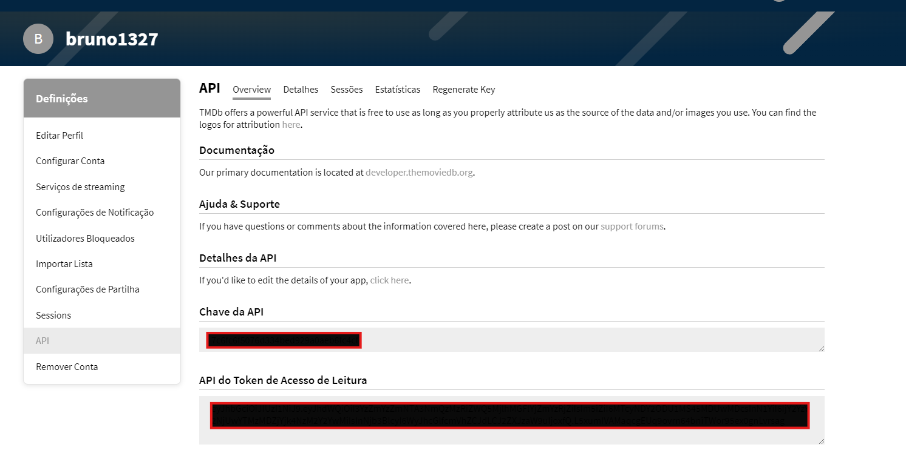

### Variáveis de ambiente
Inicialmente vamos criar um arquivo `.env` na raiz do projeto e copiar as variáveis do arquivo `.env.example` para ele
e substituir alguns valores

**`TMDB_API_KEY`-** Chave de autenticação na API do TMDB

Essa chave é adquirida no site do TMDB https://www.themoviedb.org/, basta criar uma conta e acessar o painel de API para cadastrar gerar essa chave


Após cadastrar a chave basta copiar ela para o arquivo.

**Variáveis do banco de dados**

Por padrão vamos utilizar os seguintes valores no ambiente de desenvolvimento

**`DB_USERNAME` →** admin

**`DB_PASSWORD` →** password

**`DB_DATABASE` →** movies

**`DB_PORT` →** 5432

**`DB_HOST` →** postgres-server

**OBS:** Esses valores vem por padrão no arquivo **`.env.example`** 

```
TMDB_API_KEY=<TMDB_API_KEY>

DB_USERNAME=admin
DB_PASSWORD=password
DB_DATABASE=movies
DB_PORT=5432
DB_HOST=postgres-server
```

### 🚀 Subindo o projeto

Para subir o servidor do projeto e do banco de dados vamos utilizar o docker, para isso é necessário que você o tenha instalado em sua máquina, caso não tenha basta entrar na documentação do próprio docker para seguir.  https://docs.docker.com/engine/install/

Estando com o docker configurado na máquina, basta acessar a raiz do projeto e executar o seguinte comando.

```
docker compose up -d
```

**OBS:** Pode ocorrer conflito nas portas expostas caso tenha outros containers rodando ao mesmo tempo, por isso recomendo que pare os outros.

### ✅ Verificando se tá tudo certo

Para garantir que nosso projeto está com tudo certo para você utilizar vamos precisar executar os testes.

Caso tenha o `go` instalado na sua máquina basta executar o seguinte comando na raiz do projeto 

```
go test ./... -v
```

Caso não tenha o `go` instalado você pode utilizar o container da aplicação para fazer essa validação, para isso basta executar os comandos.

```
## Utilize o comando abaixo para entrar no container da aplicação
docker exec -it likemovies-api /bin/sh

## Após entrar no container com o comando acima basta executar
go test ./... -v
```

### 📋 Documentação da API

Para acessar a documentação da API basta entrar na URL local `http://localhost:5000/swagger/index.html`, nela está contida a documentação do swegger

### 🔒 Autenticação

Todos os endpoints são segurados por **`basic auth`** com isso é necessário realizar o cadastro na API para que você possa se autenticar nos recursos que deseja consumir.

Então o primeiro passo é acessar o endpoint **`/api/v1/user/create`** e realizar o cadastro, na documentação está específicado os dados que devem ser enviado para realizar o cadastro.
